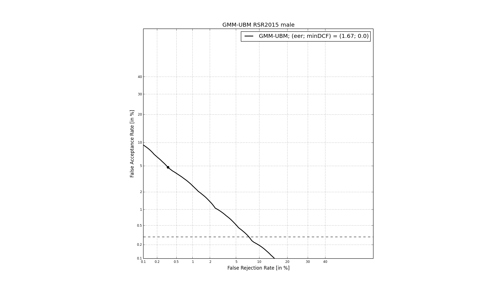

Run a GMM-UBM system
====================

This script run an experiment on the male evaluation part of the RSR2015
database. The protocols used here is based on the one described in
[Larcher14]. In this version, we only consider the non-target trials
where impostors pronounce the correct text (Imp Correct).

The number of Target trials performed is then - TAR correct: 10,244 -
IMP correct: 573,664

[Larcher14] Anthony Larcher, Kong Aik Lee, Bin Ma and Haizhou Li,
"Text-dependent speaker verification: Classifiers, databases and
RSR2015," in Speech Communication 60 (2014) 56–77

Input/Output
------------

Enter:
~~~~~~

the number of distribution for the Gaussian Mixture Models the root
directory where the RSR2015 database is stored

Generates the following outputs:
~~~~~~~~~~~~~~~~~~~~~~~~~~~~~~~~

-  a Mixture in compressed pickle format (ubm)
-  a StatServer of zero and first-order statistics (enroll\_stat)
-  a StatServer containing the super vectors of MAP adapted GMM models
   for each speaker (enroll\_sv)
-  a score file
-  a DET plot

First, loads the required PYTHON packages:

.. code:: python

    import sidekit
    import os
    import sys
    import multiprocessing
    import matplotlib.pyplot as mpl
    import logging
    import numpy as np
    
    logging.basicConfig(filename='log/rsr2015_ubm-gmm.log',level=logging.DEBUG)

Set your own parameters
-----------------------

.. code:: python

    distribNb = 128  # number of Gaussian distributions for each GMM
    rsr2015Path = '/Users/larcher/LIUM/RSR2015/RSR2015_V1/'
    
    # Default for RSR2015
    audioDir = os.path.join(rsr2015Path , 'sph/male')
    
    # Automatically set the number of parallel process to run.
    # The number of threads to run is set equal to the number of cores available 
    # on the machine minus one or to 1 if the machine has a single core.
    nbThread = max(multiprocessing.cpu_count()-1, 1)

Load IdMap, Ndx, Key from HDF5 files and ubm\_list
--------------------------------------------------

Note that these files are generated when running rsr2015\_init.py:

.. code:: python

    print('Load task definition')
    enroll_idmap = sidekit.IdMap('task/3sesspwd_eval_m_trn.h5')
    test_ndx = sidekit.Ndx('task/3sess-pwd_eval_m_ndx.h5')
    key = sidekit.Key('task/3sess-pwd_eval_m_key.h5')
    with open('task/ubm_list.txt') as inputFile:
        ubmList = inputFile.read().split('\n')

Process the audio to generate MFCC
----------------------------------

.. code:: python

    print('Create FeatureServer to extract MFCC features')
    fs = sidekit.FeaturesServer(input_dir=audioDir,
                     input_file_extension='.sph',
                     label_dir='./',
                     label_file_extension='.lbl',
                     from_file='audio',
                     config='sid_16k')

Train the Universal background Model (UBM)
------------------------------------------

Create a FeaturesServer to process audio files:

.. code:: python

    print('Train the UBM by EM')
    # Extract all features and train a GMM without writing to disk
    ubm = sidekit.Mixture()
    llk = ubm.EM_split(fs, ubmList, distribNb, numThread=nbThread)
    ubm.save_pickle('gmm/ubm.p')

Compute the sufficient statistics on the UBM
--------------------------------------------

Make use of the new UBM to compute the sufficient statistics of all
enrolement sessions that should be used to train the speaker GMM models.
An empty StatServer is initialized from the enroll\_idmap IdMap.
Statistics are then computed in the enroll\_stat StatServer which is
then stored in compressed pickle format:

.. code:: python

    print('Compute the sufficient statistics')
    # Create a StatServer for the enrollment data and compute the statistics
    enroll_stat = sidekit.StatServer(enroll_idmap, ubm)
    enroll_stat.accumulate_stat(ubm=ubm, feature_server=fs, seg_indices=range(enroll_stat.segset.shape[0]), numThread=nbThread)
    enroll_stat.save('data/stat_rsr2015_male_enroll.h5')

Adapt the GMM speaker models from the UBM via a MAP adaptation
--------------------------------------------------------------

Train a GMM for each speaker. Only adapt the mean supervector and store
all of them in the enrol\_sv StatServer that is then stored to disk:

.. code:: python

    print('MAP adaptation of the speaker models')
    regulation_factor = 3  # MAP regulation factor
    enroll_sv = enroll_stat.adapt_mean_MAP(ubm, regulation_factor)
    enroll_sv.save('data/sv_rsr2015_male_enroll.h5')

Compute all trials and save scores in HDF5 format
-------------------------------------------------

.. code:: python

    print('Compute trial scores')
    scores_gmm_ubm = sidekit.gmm_scoring(ubm, 
                                       enroll_sv, 
                                       test_ndx,
                                       fs, 
                                       numThread=nbThread)
    scores_gmm_ubm.save('scores/scores_gmm-ubm_rsr2015_male.h5')

Plot DET curve and compute minDCF and EER
-----------------------------------------

.. code:: python

    print('Plot the DET curve')
    # Set the prior following NIST-SRE 2008 settings
    prior = sidekit.effective_prior(0.01, 10, 1)
    # Initialize the DET plot to 2008 settings
    dp = sidekit.DetPlot(windowStyle='old', plotTitle='GMM-UBM RSR2015 male')
    dp.set_system_from_scores(scores_gmm_ubm, key, sys_name='GMM-UBM')
    dp.create_figure()
    dp.plot_rocch_det(0)
    dp.plot_DR30_both(idx=0)
    dp.plot_mindcf_point(prior, idx=0)

The following plot should be obtained at the end of this tutorial:

.. code:: python

    from IPython.display import Image
    Image(filename='rsr2015_GMM-UBM128_map3_snr40_cmvn_rasta_logE.png')

